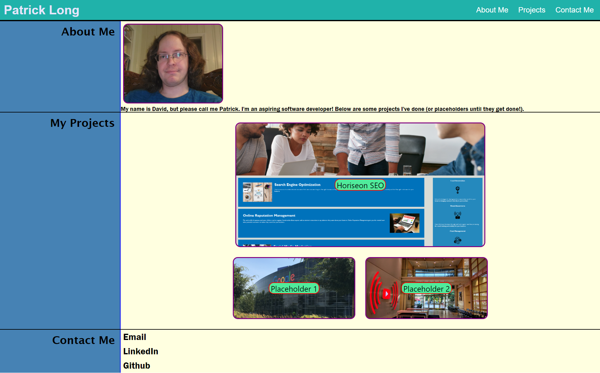

# Patrick Long | Portfolio

## Table of Contents

- [Description](#description)
- [Visuals](#visuals)
- [Resources](#resources)

## Description

Created a portfolio mockup page displaying an about me section, a project section, and a contact me section. The about me section contains a profile photo and a short intro section. The projects section contains three projects, two of which were placeholders. The contact me section contains links to email, LinkedIn, and Github. The page contains responsive elements that adjust to the size of the viewport.

## Visuals

## Resources

[Live Site](https://bureizu742.github.io/dplong-portfolio//)

[Repository](https://github.com/Bureizu742/dplong-portfolio)